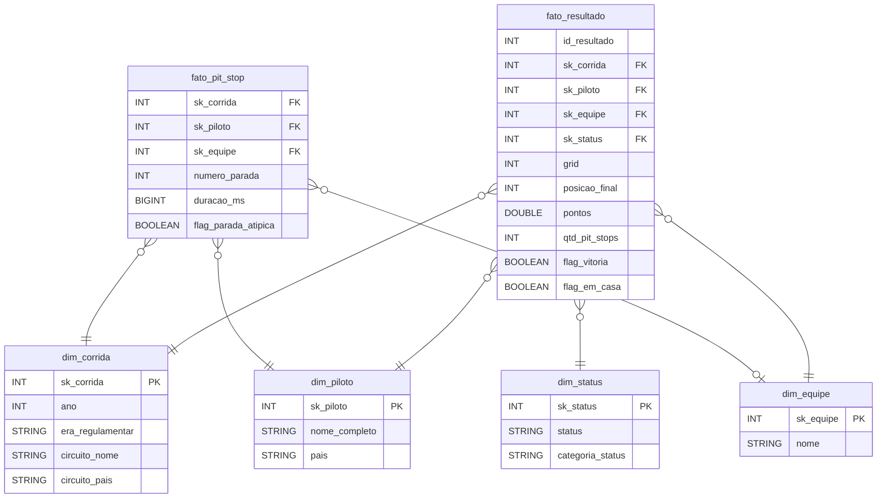

# MVP Engenharia de Dados - O que decide uma corrida de Fórmula 1?

Rodrigo - Pós-graduação, MVP da sprint de Engenharia de Dados

Plataforma: Databricks Free Edition (Unity Catalog e Delta Lake), com notebooks em PySpark e SQL.
Fonte: dataset de F1 do Kaggle (1950 a 2024), baixado pela API.

## Sumário
1. [Objetivo e perguntas](#1-objetivo-e-perguntas)
2. [Coleta e carga](#2-coleta-e-carga)
3. [Modelagem e catálogo](#3-modelagem-e-catálogo)
4. [Pipeline](#4-pipeline)
5. [Qualidade dos dados](#5-qualidade-dos-dados)
6. [Análise](#6-análise)
7. [Autoavaliação](#7-autoavaliação)
8. [Como rodar](#8-como-rodar)

---

## 1. Objetivo e perguntas

Sempre ouvi que na F1 "corrida se ganha na pista e campeonato se ganha na fábrica". Quis ver o que os dados dizem sobre isso: o que realmente pesa no resultado de uma corrida (a posição de largada, a estratégia de pit stop, a confiabilidade do carro, o piloto, correr em casa) e se isso mudou com o tempo.

Esse tipo de análise interessa, por exemplo, a uma equipe que precisa decidir onde investir, ou a quem transmite as corridas e quer saber o que destacar.

Antes da F1 eu tinha pensado em trabalhar com preço de combustível da ANP. Desisti porque já existem vários MVPs com esse tema e as perguntas ficariam parecidas. Com a F1 consegui usar um banco relacional com bastante tabela, o que dá mais trabalho de modelagem (e deixa o projeto mais interessante).

### Perguntas

1. Largar na pole decide a corrida? Isso mudou ao longo das eras e depende do circuito?
2. Os pit stops ficaram mais rápidos? Fazer menos paradas está ligado a ganhar posições?
3. A F1 ficou mais confiável? Como evoluíram os abandonos por quebra e por acidente?
4. Carro ou piloto? Quais pilotos mais bateram o próprio companheiro de equipe (mesmo carro)?
5. Existe vantagem de correr em casa?
6. As temporadas ficaram mais ou menos disputadas? Quais eras foram mais dominadas por uma equipe?

### Sobre os dados

O dataset é o [Formula 1 World Championship (1950 - 2024)](https://www.kaggle.com/datasets/rohanrao/formula-1-world-championship-1950-2020), que é uma cópia do Ergast, a base histórica mais usada da F1. São 14 CSVs que formam um modelo relacional, ligados por ids (raceId, driverId, constructorId etc.).

Uma coisa que chama atenção logo de cara: o nulo não é nulo, é o texto `\N`.

Tamanho depois da carga: 1.125 corridas, 861 pilotos, 212 equipes, 77 circuitos, 26.759 resultados e 589.081 tempos de volta.

Principais arquivos:
- races, circuits, seasons: corridas, circuitos e temporadas
- drivers, constructors: pilotos e equipes
- results e sprint_results: resultado de cada piloto em cada corrida
- qualifying: treino classificatório (Q1, Q2, Q3)
- pit_stops e lap_times: paradas nos boxes e tempo de cada volta
- driver_standings, constructor_standings, constructor_results: campeonatos depois de cada corrida
- status: como o piloto terminou (Finished, Engine, Accident, +1 Lap...)

### Licença

CC0 (domínio público), conforme a página do Kaggle. Pode ser usado para qualquer fim sem pedir permissão. Mesmo assim cito a origem (Ergast / Kaggle). Não tem dado sensível, só informação pública de piloto profissional.

---

## 2. Coleta e carga

**Setup** (`00_setup.sql`): cria o catálogo `mvp_f1`, os schemas `landing`, `config`, `bronze`, `silver` e `gold`, e dois volumes: `landing.arquivos` para os CSVs e `config.credenciais` para o token do Kaggle.

**Coleta** (`01_ingestao_bronze.py`): o notebook instala a biblioteca `kaggle`, autentica e baixa o dataset direto no volume.

Aqui tive um problema. Montei a autenticação com o `kaggle.json` (usuário + chave), mas na minha conta o Kaggle já gera o token no formato novo, que é um texto só. Ajustei para ler um arquivo `kaggle_token.txt` do volume de credenciais (e deixei o `kaggle.json` e o secret scope como alternativa). O token não fica no código nem no GitHub.

Se os arquivos já estiverem no volume o download é pulado, então dá pra rodar de novo sem baixar tudo outra vez.

**Bronze:** cada CSV virou uma tabela Delta com o mesmo nome, sem mexer em nenhum valor. Tudo como texto e o `\N` mantido. Acrescentei três colunas de controle (arquivo de origem, fonte e data da ingestão), e cada carga fica registrada em `bronze.controle_ingestao`.

(print: volume com os CSVs) `docs/img/01_volume.png`
(print: tabela controle_ingestao) `docs/img/02_controle_ingestao.png`

---

## 3. Modelagem e catálogo

Escolhi um modelo estrela com duas tabelas fato. Quase todas as perguntas giram em torno de dois eventos: o resultado de um piloto numa corrida e uma parada nos boxes. Os dois são descritos pelas mesmas dimensões (corrida, piloto, equipe), então as dimensões são compartilhadas.

Algumas decisões:

- Não criei uma dimensão de circuito. Os dados do circuito ficaram dentro da `dim_corrida`, porque assim as análises por circuito ou país precisam de um join só.
- Criei a coluna `era_regulamentar` na `dim_corrida`, separando a história em 8 eras (clássica, efeito solo, turbo, V10, V8, híbrida etc.). Comparar 1960 com 2020 direto não faz sentido, muda tudo: motor, pneu, sistema de pontos.
- Reaproveitei os ids do Ergast como chave. Eles já são inteiros sem significado e não mudam entre versões do dataset.
- Algumas medidas já vão calculadas na fato (posições ganhas, vitória, pódio, corre em casa, número de paradas, idade do piloto). A regra fica num lugar só e as consultas de análise ficam bem mais simples.
- Criei também uma tabela `agg_temporada` com o resumo de cada ano, para a pergunta 6. A margem do campeão está em %, porque o sistema de pontos mudou várias vezes.
- Declarei PK e FK no Unity Catalog. No Databricks elas são só informativas, mas documentam o modelo e geram o diagrama no Catalog Explorer.

O catálogo de dados completo, com descrição, tipo, domínio e origem de cada coluna, está em [docs/catalogo_dados.md](docs/catalogo_dados.md). As mesmas descrições foram gravadas como COMMENT nas tabelas, então também aparecem no Catalog Explorer.

(print: colunas comentadas da fato_resultado) `docs/img/03_catalogo_fato.png`
(print: diagrama de relacionamentos) `docs/img/04_erd.png`
(print: aba Lineage da fato_resultado) `docs/img/05_lineage.png`

---

## 4. Pipeline

Separei o pipeline em um notebook por etapa:

- [00_setup.sql](notebooks/00_setup.sql): cria catálogo, schemas e volumes
- [01_ingestao_bronze.py](notebooks/01_ingestao_bronze.py): baixa pela API do Kaggle e grava as 14 tabelas na Bronze
- [02_qualidade_bronze.py](notebooks/02_qualidade_bronze.py): análise de qualidade do dado bruto (só leitura)
- [03_silver_transformacao.py](notebooks/03_silver_transformacao.py): limpeza, tipagem e padronização, gera 10 tabelas na Silver
- [04_gold_modelagem.sql](notebooks/04_gold_modelagem.sql): monta o modelo estrela e o agregado por temporada
- [05_analise.sql](notebooks/05_analise.sql): consultas e gráficos das 6 perguntas

### Tratamentos na Silver

- `\N` e texto vazio viram NULL em todas as colunas. Sem isso as conversões de tipo e as contagens de nulos dão errado.
- Conversão de tipos com `try_cast`. Se aparecer algum valor estranho ele vira NULL em vez de quebrar a execução.
- Os tempos de classificação e de volta mais rápida vêm como texto ("1:23.456"), converti para milissegundos para dar pra comparar e fazer média.
- Padronizei os países dos circuitos (USA e United States eram grupos diferentes, e também UK, UAE e Korea) e a nacionalidade dos pilotos (tinha "Argentinian " com espaço, além de "Argentine").
- Montei um de-para de nacionalidade para país, na mão, para conseguir comparar o piloto com o país do circuito na pergunta 5.
- Os 141 status foram agrupados em 6 categorias (terminou, falha mecânica, acidente, piloto, não largou/desclassificado, outros).
- `grid = 0` virou NULL com uma flag. Zero não é posição, é quem largou dos boxes, e ia distorcer as médias.
- Paradas de pit stop muito longas (bandeira vermelha, conserto) ganharam uma flag e ficam fora das médias.
- Renomeei tudo para português em snake_case e coloquei comentário em todas as colunas.

Deixei 4 tabelas só na Bronze porque nenhuma pergunta precisa delas: lap_times, sprint_results, constructor_results e seasons.

### Gold

As dimensões vêm direto da Silver e as fatos são montadas com joins. A carga é completa (apaga e recria), então pode rodar quantas vezes precisar. No fim do notebook tem uma checagem de que não ficou nenhum registro órfão nas fatos e uma consulta mostrando de que ano até que ano existe cada tipo de dado.

### Orquestração

Os notebooks 01 a 05 foram encadeados num Job do Databricks, uma tarefa por notebook, cada uma dependendo da anterior.

(print: job com a execução) `docs/img/06_job.png`
(print: tabelas nos schemas bronze/silver/gold) `docs/img/07_tabelas.png`

---

## 5. Qualidade dos dados

A análise completa está no notebook `02_qualidade_bronze.py`. Resumo do que encontrei:

**Completude:** a maioria dos nulos altos é esperada. `results.position` está vazio em 41% das linhas (quem abandonou ou não foi classificado não tem posição oficial), `qualifying.q3` em 65% (só os 10 primeiros do treino chegam no Q3) e `drivers.code` em 88% (o código de 3 letras não existia para piloto antigo). Nas análises usei `posicao_final`, que está sempre preenchida.

O que mais pesou foi a cobertura: tem resultado de 1950 a 2024, mas qualifying só a partir de 1994 e pit stop só a partir de 2011. Por isso a pergunta 4 cobre 1994 em diante e a pergunta 2 cobre 2011 em diante.

**Unicidade:** os ids são únicos em todas as tabelas. Apareceram 91 casos de piloto com mais de um resultado na mesma corrida, todos dos anos 50 (boa parte na Indy 500), quando era permitido dividir carro. Mantive, porque é história real.

**Integridade referencial:** nenhum registro órfão. Repeti a checagem na Gold e também deu zero.

**Consistência:** o país do circuito aparece como USA em 11 circuitos e United States em 1. UK e UAE também estavam abreviados. Um piloto tinha a nacionalidade "Argentinian " com espaço, enquanto os outros 24 argentinos estavam como "Argentine". E 517 pit stops tinham a `duration` no formato "16:44.718", porque passaram de 60 segundos (por isso usei `milliseconds`).

**Acurácia:** 1.638 resultados com grid = 0. As idades dos pilotos ficaram entre 17,5 e 58,8 anos, nada fora do normal.

**Outliers:** a mediana de pit stop fica em torno de 22 a 24 segundos, mas a maior parada chega a 3.069 segundos (51 minutos, em 2022), que é o carro parado no pit lane durante bandeira vermelha. Marquei como atípico o que passa de Q3 + 3*IQR da temporada.

No final do notebook 03 coloquei asserts que param a execução se alguma regra básica falhar: chave duplicada, posição inválida, ponto negativo, corrida sem data ou país sem padronizar.

(print: completude) `docs/img/08_completude.png`
(print: outliers de pit stop) `docs/img/09_outliers_pit.png`

---

## 6. Análise

Consultas em [05_analise.sql](notebooks/05_analise.sql).

### 1. A pole decide a corrida?
Calculei, por era, quantas poles viraram vitória, o grid médio de quem venceu e a correlação entre posição de largada e de chegada. Também fiz um ranking por circuito (mínimo de 10 corridas).

`docs/img/p1_pole.png`

Decide mais hoje do que antigamente. Nos anos 50 a 70 quem largava na pole vencia em torno de 37% das vezes, e nos anos 80 caiu para 28%, que era a época em que o carro quebrava muito. A partir dos anos 2000 passou para 50% e ficou por aí (52% nos anos 2020). A correlação entre posição de largada e de chegada vai no mesmo sentido: 0,43 na era clássica, 0,33 nos anos 80 e 0,63 hoje. E em 88% das corridas da era híbrida o vencedor largou entre os três primeiros.

Por circuito o resultado me surpreendeu. Esperava Mônaco no topo, mas lá a pole virou vitória em 45% das 71 corridas, porque o histórico longo inclui décadas de muito abandono. Quem lidera é Barcelona (71%), seguido de Abu Dhabi (69%) e Singapura (67%), todos circuitos onde ultrapassar é difícil. No outro extremo estão Monza (33%) e Spa (37%), com retas longas e vácuo.

### 2. Pit stops
Mediana do tempo no pit lane por temporada (sem as atípicas), e posições ganhas / % de pódio por número de paradas, só de quem terminou a prova.

`docs/img/p2_pit.png`

Aqui a resposta é não. Com os dados que existem (2011 a 2024) a mediana do tempo no pit lane ficou praticamente parada: 22 segundos entre 2011 e 2013 e em torno de 23,5 a 24 segundos depois disso. Imagino que a troca de pneus em si tenha ficado mais rápida, mas o dataset mede o tempo inteiro dentro do pit lane, que depende mais do tamanho do pit lane e do limite de velocidade do que da equipe. Não dá para separar as duas coisas com esse dado.

O que mudou foi o número de paradas: 2,55 por piloto em 2011 (primeiro ano da Pirelli, pneu que degradava muito) e entre 1,4 e 2 nos anos seguintes.

Sobre estratégia: entre os pilotos que terminaram a prova, quem parou uma vez ganhou em média mais posições do que quem parou três ou quatro (na era atual, 1,4 posição contra 0,1 com quatro paradas). Mas não trataria isso como causa. Normalmente quem para mais é quem teve problema, e quem está na frente consegue fazer a estratégia ideal.

### 3. Confiabilidade
Como os pilotos que largaram terminaram a prova, por década (terminou, quebrou, acidente), e as 3 quebras mais comuns em cada era.

`docs/img/p3_confiabilidade.png`

Essa é a resposta mais clara do projeto. Até os anos 90 só metade dos pilotos que largavam chegava ao fim (45% nos anos 80). Nos anos 2000 foram 69%, nos 2010 81% e nos 2020 86%.

A queda veio quase toda das quebras. Falha mecânica tirava 41% do grid nos anos 60 e 80, caiu para 19% nos anos 2000 e está em 6% hoje. Os acidentes também caíram (o pico foi 18% nos anos 90, hoje estão em 7%), mas bem menos.

O motor foi o componente que mais quebrou em todas as eras, só que em número absoluto despencou: 513 quebras de motor entre 1968 e 1982 contra 22 entre 2022 e 2024. Algumas quebras são a cara da época: turbo aparece em segundo nos anos 80 e a "Power Unit" aparece na era híbrida.

### 4. Carro ou piloto
Comparei a posição no qualifying entre os dois pilotos da mesma equipe em cada corrida. Ranking de quem mais venceu esse duelo, com pelo menos 50 duelos.

`docs/img/p4_companheiros.png`

Os campeões aparecem, mas não só eles. No topo estão Häkkinen (81% dos duelos vencidos), Verstappen (78%), Russell (75%) e Alonso (73%, em 385 duelos, o que para mim é o número mais impressionante da lista pela quantidade). Hamilton ficou com 62%, abaixo do que eu esperava, mas ele passou boa parte da carreira ao lado de companheiros fortes, como Alonso, Rosberg, Bottas e Russell.

Também aparecem nomes como Buemi, Panis e Albon, que bateram companheiros sem ter carro para disputar título. Acho que é o que a pergunta queria mostrar: o piloto faz diferença, mas o resultado final depende muito do carro.

Duas limitações importantes: só tem qualifying a partir de 1994 (Senna, Prost e Lauda ficam de fora) e a métrica depende de quem foi o companheiro.

### 5. Correr em casa
Comparei o mesmo piloto na mesma temporada: resultado no GP de casa contra a média dele nas outras corridas do ano. Fiz assim para não misturar com piloto local convidado que só corre em casa, geralmente com carro fraco.

`docs/img/p5_casa.png`

Existe, mas é pequena. Comparando o mesmo piloto na mesma temporada, ele chega em média 0,09 posição à frente no GP de casa, e em 55% dos casos foi melhor em casa do que fora. A taxa de pódio sobe de 12,7% para 14%. É uma diferença tão pequena que eu não afirmaria que é vantagem de verdade e não ruído.

A tabela por país mostra bem por que a comparação pareada era necessária. Estados Unidos, Reino Unido e África do Sul aparecem com resultado muito pior em casa, mas é porque muitos pilotos locais só corriam o GP de casa, com carro fraco (e nos anos 50 a Indy 500 contava para o campeonato). Argentinos (8,7 em casa contra 10,5 fora) e franceses são os que mais parecem render em casa. Brasileiros foram um pouco pior em Interlagos do que fora.

### 6. Competitividade
Por era: média de vencedores diferentes por temporada, % de vitórias da equipe mais vitoriosa e margem do campeão. Mais o top 5 de temporadas mais dominadas e mais disputadas.

`docs/img/p6_competitividade.png`

Ficou menos disputada nas últimas eras. Na era híbrida (2014 a 2021) a equipe mais vitoriosa ganhou em média 71% das corridas de cada temporada, a maior taxa de todas. De 2022 a 2024 foi 70%, puxado por 2023, a temporada mais dominada da história: a Red Bull venceu 95,5% das corridas e Verstappen foi campeão com 50% de vantagem sobre o vice. A era mais equilibrada foi a de 1968 a 1982, com 41% e quase 7 vencedores diferentes por ano.

Um detalhe que eu achei interessante: domínio de equipe não quer dizer campeonato fácil. Em 2016 a Mercedes ganhou 90% das corridas e mesmo assim o título foi decidido por 1,3% de diferença, porque a briga era entre os dois pilotos da própria Mercedes. O mesmo aconteceu em 1988 com a McLaren (94% das vitórias, Senna campeão por 3%).

As decisões mais apertadas foram 1984 (Lauda por meio ponto, 0,7%), 2007, 2008, 1994 e 2012. Mudança de regulamento costuma trocar quem domina: a Mercedes em 2014 e a Red Bull em 2022.

### Conclusão geral
Voltando à pergunta do título: o que mais decide uma corrida mudou bastante ao longo do tempo.

Até os anos 90 o maior fator era chegar ao fim. Com metade do grid abandonando, largar na frente valia menos e a confiabilidade decidia muita coisa. Com os carros quase sem quebrar, o peso foi para o sábado: a posição de largada nunca foi tão importante quanto hoje, e isso se soma a eras longas de uma equipe só. O carro continua sendo o fator principal, e o piloto aparece mais nos duelos com o companheiro do que no resultado final. Estratégia de pit stop e correr em casa pesam pouco perto disso, pelo menos com o que esse dataset consegue medir.

No fim a frase do começo faz sentido: a corrida se decide cada vez mais na classificação, e o campeonato na fábrica.

---

## 7. Autoavaliação

**Objetivos.** Consegui responder as seis perguntas. Três delas saíram completas: a da pole, a de confiabilidade e a de competitividade, porque usam resultados e campeonatos, que existem desde 1950. As outras três ficaram parciais por causa do dado. A de pit stop só cobre 2011 em diante, e o dataset mede o tempo no pit lane inteiro, então não consegui responder direito se as equipes ficaram mais rápidas na troca de pneus. A do companheiro de equipe só tem qualifying a partir de 1994, e pilotos como Senna e Prost ficaram de fora. A de correr em casa teve uma resposta honesta ("quase não existe"), mas com um efeito tão pequeno que não dá para ter certeza.

No pipeline em si fiquei satisfeito. Ele roda do começo ao fim sem intervenção, a coleta é pela API, as três camadas estão separadas e toda tabela e coluna tem descrição no catálogo.

**Dificuldades.** A maior parte do tempo não foi com a análise, foi com configuração:
- Conectar o Databricks ao GitHub deu erro no login pelo navegador (OAuth). Resolvi criando um token de acesso no GitHub.
- A autenticação do Kaggle mudou. O código que eu tinha montado usava o `kaggle.json` com usuário e chave, e minha conta já gera o token no formato novo. Tive que entender que a biblioteca autentica sozinha no momento do import e ajustar o notebook.
- Um erro bobo no `.gitignore`: colei as regras com espaço na frente e elas não funcionavam.
- Na Gold, rodar o notebook de novo dava erro ao recriar as dimensões por causa das FKs. Precisei apagar as fatos antes.

Na parte de dados, o que mais deu trabalho foi o tratamento. Agrupar os 141 status em categorias exigiu olhar valor por valor. O de-para de nacionalidade para país tive que montar na mão, e o `\N` como texto no lugar de nulo quebrava as conversões até eu tratar.

**O que aprendi.** Que olhar a qualidade antes de transformar economiza muito retrabalho. Várias decisões da Silver (usar `milliseconds` em vez de `duration`, tratar `grid = 0`, marcar as paradas de bandeira vermelha) só apareceram porque fiz o notebook 02 antes. Também percebi que o jeito de comparar muda a conclusão: na pergunta do fator casa, a média simples mostrava pilotos americanos e britânicos muito piores em casa, e isso só fez sentido quando comparei o mesmo piloto na mesma temporada.

**Limitações dos dados.**
- Qualifying só existe a partir de 1994 e pit stop a partir de 2011.
- O tempo de pit stop inclui o pit lane inteiro, que varia de circuito para circuito.
- O sistema de pontos mudou várias vezes. Contornei usando a margem do campeão em % em vez de pontos absolutos.
- Entre 1950 e 1960 a Indy 500 contava para o campeonato, com pilotos que só corriam ela, e isso distorce as análises por país.
- O dataset para em 2024, porque o Ergast foi descontinuado.

**O que faria depois.**
- Usar a tabela de voltas (`lap_times`), que ficou só na Bronze, para analisar ritmo de corrida, desgaste de pneu e undercut.
- Trazer 2025 em diante pela API do OpenF1, com carga incremental (MERGE) em vez de recarregar tudo.
- Montar um dashboard no Databricks SQL em cima da Gold.

---

## 8. Como rodar

1. Criar uma conta no Databricks Free Edition.
2. Em Workspace, criar um Git folder apontando para este repositório.
3. Rodar o `00_setup.sql`.
4. No Kaggle, ir em Settings > API Tokens e gerar um token. Salvar o texto do token num arquivo `kaggle_token.txt` e fazer upload no volume `mvp_f1.config.credenciais` (pelo Catalog). Não subir esse arquivo no GitHub.
5. Rodar os notebooks 01 a 05 em ordem, ou rodar o Job.

Os dados não ficam no repositório. Eles são baixados da fonte a cada execução.
