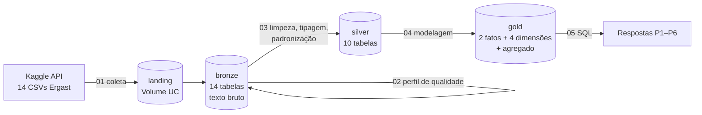
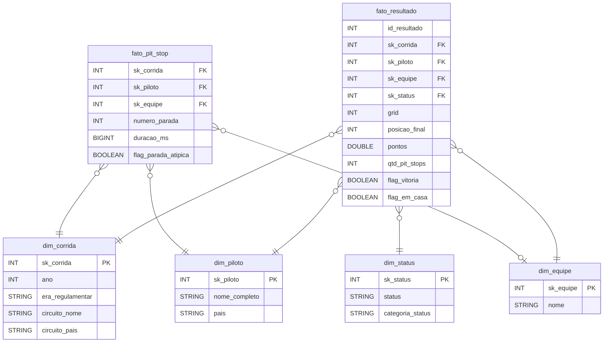

# MVP · O que decide uma corrida de Fórmula 1? (1950–2024)

**Autor:** Rodrigo · Pós-graduação: MVP de Engenharia de Dados
**Plataforma:** Databricks Free Edition (Unity Catalog + Delta Lake) · **Linguagens:** PySpark e SQL
**Fonte:** Kaggle (API) · Formula 1 World Championship 1950–2024 (Ergast), licença CC0

> Pipeline de ponta a ponta que coleta os dados históricos da F1 pela API do Kaggle, organiza em camadas
> Bronze → Silver → Gold e responde a perguntas sobre o peso do grid, da estratégia, da confiabilidade, do piloto
> e do fator casa em 75 anos de corridas.

## Sumário
1. [Contexto de Negócios e Perguntas (Etapas 2 e 4.1)](#1-contexto-de-negócios-e-perguntas-etapas-2-e-41)
2. [Carga dos Dados (Etapa 4.2)](#2-carga-dos-dados-etapa-42)
3. [Modelagem e Catálogo de Dados (Etapa 4.3)](#3-modelagem-e-catálogo-de-dados-etapa-43)
4. [Pipeline de Dados (Etapa 4.4)](#4-pipeline-de-dados-etapa-44)
5. [Qualidade de Dados (Etapa 4.5)](#5-qualidade-de-dados-etapa-45)
6. [Análise de Dados (Etapa 4.5)](#6-análise-de-dados-etapa-45)
7. [Autoavaliação](#7-autoavaliação)
8. [Como reproduzir](#8-como-reproduzir)

---

## 1. Contexto de Negócios e Perguntas (Etapas 2 e 4.1)

### Problema
Na Fórmula 1 se diz que "corridas se ganham na pista, campeonatos se ganham na fábrica". Uma equipe decide onde
investir (classificação, pit crew, confiabilidade, pilotos) e um canal de transmissão decide o que destacar ao público.
Os dois precisam saber **quais fatores de fato decidem os resultados e como o peso de cada um mudou ao longo das eras
regulamentares**.

**Objetivo:** usar 75 anos de dados oficiais para medir o peso de **posição de largada, estratégia de pit stop,
confiabilidade, piloto e fator casa** no resultado, e o quanto as temporadas são competitivas.

### Perguntas de negócio
| # | Pergunta | Fator investigado |
|---|---|---|
| P1 | Largar na pole decide a corrida? Isso mudou entre as eras e varia por circuito? | Classificação / grid |
| P2 | Os pit stops ficaram mais rápidos? Fazer menos paradas está associado a ganhar posições? | Estratégia |
| P3 | A F1 ficou mais confiável? Como evoluíram os abandonos por falha mecânica e por acidente? | Confiabilidade |
| P4 | Carro ou piloto? Quais pilotos mais superaram o próprio companheiro de equipe (mesmo carro)? | Piloto |
| P5 | Existe vantagem de correr em casa? | Fator casa |
| P6 | As temporadas ficaram mais ou menos competitivas? Quais eras foram mais dominadas por uma equipe? | Equilíbrio |

### Dados brutos
- **Fonte:** Kaggle, [Formula 1 World Championship (1950 - 2024)](https://www.kaggle.com/datasets/rohanrao/formula-1-world-championship-1950-2020)
  (`rohanrao/formula-1-world-championship-1950-2020`, versão 24, atualizada em 29/01/2025). É uma cópia do
  **Ergast Motor Racing Database**, a base de referência histórica da F1.
- **Formato:** 14 arquivos CSV (cerca de 22 MB), separados por vírgula. Nulos aparecem como o texto `\N`.
  É um modelo **relacional normalizado**: as tabelas se ligam por ids (`raceId`, `driverId`, `constructorId`…).
- **Volume:** _preencher após a carga_ (ex.: ~1.100 corridas, ~860 pilotos, ~210 equipes, ~27 mil resultados, ~600 mil voltas).

| Arquivo | Conteúdo | Chave |
|---|---|---|
| races, circuits, seasons | Corridas, circuitos, temporadas | raceId, circuitId, year |
| drivers, constructors | Pilotos e equipes | driverId, constructorId |
| results, sprint_results | Resultado de cada piloto em cada corrida/sprint | resultId (raceId + driverId) |
| qualifying | Classificação (Q1/Q2/Q3) | qualifyId |
| pit_stops, lap_times | Paradas nos boxes e tempo de cada volta | raceId + driverId + stop/lap |
| driver_standings, constructor_standings, constructor_results | Campeonatos após cada corrida | *StandingsId |
| status | Situação final (Finished, Engine, Accident, +1 Lap…) | statusId |

### Licença
**CC0 1.0: Public Domain**, conforme a página do dataset no Kaggle. Os dados podem ser usados, modificados e
distribuídos para qualquer fim, sem necessidade de permissão. A origem (Ergast / Kaggle) é citada por boa prática.
Não há dados pessoais sensíveis: apenas informações públicas de pilotos profissionais (nome, nacionalidade, data de nascimento).

---

## 2. Carga dos Dados (Etapa 4.2)

1. **Estrutura no Unity Catalog** (`notebooks/00_setup.sql`): catálogo `mvp_f1`, schemas `landing`, `config`, `bronze`,
   `silver`, `gold` e os volumes `landing.arquivos` (CSVs) e `config.credenciais` (chave da API).
2. **Coleta automatizada via API do Kaggle** (`notebooks/01_ingestao_bronze.py`):
   - Instala a biblioteca oficial `kaggle`.
   - Lê a credencial de um **secret scope** do Databricks ou, alternativamente, do `kaggle.json` guardado no volume
     `config.credenciais`. **A chave nunca aparece no código nem no GitHub** (`kaggle.json` está no `.gitignore`).
   - Baixa e descompacta o dataset direto no volume `landing.arquivos`. A execução é **idempotente**: se os arquivos
     já estão lá, o download é pulado.
   - Confere se os 14 arquivos esperados chegaram.
3. **Bronze:** cada CSV vira uma tabela Delta (`bronze.results`, `bronze.drivers`…) **sem alterar valores**. Todas as
   colunas ficam como texto e o `\N` é mantido. São adicionados `_arquivo_origem`, `_fonte` e `_data_ingestao`.
   Cada carga é registrada em `bronze.controle_ingestao` (tabela, linhas, colunas, data).

> 📸 _Screenshot: volume com os CSVs baixados pela API_ → `docs/img/01_volume.png`
> 📸 _Screenshot: tabela `controle_ingestao` com as contagens_ → `docs/img/02_controle_ingestao.png`

---

## 3. Modelagem e Catálogo de Dados (Etapa 4.3)

**Modelo escolhido: Esquema Estrela com duas fatos e dimensões conformadas.** A fonte é um modelo relacional
normalizado (bom para gravar, ruim para analisar). As perguntas giram em torno de dois eventos, **o resultado de um
piloto numa corrida** e **uma parada nos boxes**, descritos pelas mesmas dimensões (corrida, piloto, equipe).

**Decisões de modelagem**
- **Circuito desnormalizado em `dim_corrida`** (estrela, não snowflake): perguntas por circuito/país usam um único join.
- **Era regulamentar como atributo de `dim_corrida`:** a F1 muda de regulamento em blocos (turbo, V10, V8, híbrida…).
  Toda comparação histórica é feita por era, e não só por ano.
- **Chaves:** os ids do Ergast já são inteiros sem significado de negócio e estáveis entre versões, então são reaproveitados.
- **Medidas pré-calculadas na fato** (`posicoes_ganhas`, `flag_vitoria`, `flag_em_casa`, `qtd_pit_stops`, `idade_piloto`):
  a regra fica num lugar só e as consultas de análise ficam simples.
- **Agregado `agg_temporada`:** resumo de competitividade por ano (vencedores distintos, domínio da equipe top,
  margem do campeão em %, que neutraliza as mudanças no sistema de pontos).
- **PK/FK informativas no Unity Catalog:** documentam o modelo e geram o diagrama de relacionamentos no Catalog Explorer.

**Catálogo de dados:** transcrito em [`docs/catalogo_dados.md`](docs/catalogo_dados.md), com descrição, tipo, domínio e
linhagem de cada coluna das três camadas. As mesmas descrições estão gravadas como `COMMENT` no Unity Catalog.

> 📸 _Screenshot: Catalog Explorer com as colunas comentadas de `fato_resultado`_ → `docs/img/03_catalogo_fato.png`
> 📸 _Screenshot: diagrama de relacionamentos (Catalog Explorer → fato_resultado → View relationships)_ → `docs/img/04_erd.png`
> 📸 _Screenshot: aba Lineage de `fato_resultado`_ → `docs/img/05_lineage.png`

---

## 4. Pipeline de Dados (Etapa 4.4)

Um notebook por etapa. Cada um tem uma responsabilidade e pode ser reexecutado isoladamente:

| Notebook | Linguagem | Entrada → Saída | Responsabilidade |
|---|---|---|---|
| [`00_setup.sql`](notebooks/00_setup.sql) | SQL | — → catálogo/schemas/volumes | Estrutura do Lakehouse |
| [`01_ingestao_bronze.py`](notebooks/01_ingestao_bronze.py) | PySpark | API Kaggle → 14 tabelas `bronze.*` | Extract + Load bruto |
| [`02_qualidade_bronze.py`](notebooks/02_qualidade_bronze.py) | PySpark/SQL | Bronze → relatório | Perfil de qualidade (6 dimensões) |
| [`03_silver_transformacao.py`](notebooks/03_silver_transformacao.py) | PySpark | Bronze → 10 tabelas `silver.*` | Limpeza, tipagem, padronização |
| [`04_gold_modelagem.sql`](notebooks/04_gold_modelagem.sql) | SQL | Silver → `gold.*` | Esquema estrela + agregado |
| [`05_analise.sql`](notebooks/05_analise.sql) | SQL (+ Python p/ gráficos) | Gold → respostas | Perguntas P1–P6 |

**Transformações documentadas (Silver)**

| # | Transformação | Por quê | Impacto |
|---|---|---|---|
| T1 | `\N` e vazio → `NULL` em todas as colunas | Sem isso, casts falham e contagens de nulos ficam erradas | _n_ valores |
| T2 | Tipagem com `try_cast` (INT, DOUBLE, DATE, BIGINT) | Permite cálculos; não quebra o pipeline com valor inesperado | todas as colunas |
| T3 | Tempos `m:ss.sss` → milissegundos (Q1/Q2/Q3, volta mais rápida) | Tempos viram números comparáveis | _n_ valores |
| T4 | Padronização de país (`USA`/`United States`, `UK`, `UAE`, `Korea`) e nacionalidade (`Argentinian ` → `Argentine`) | Mesmo país não pode virar dois grupos | _n_ circuitos, 1 piloto |
| T5 | De-para nacionalidade → país (enriquecimento manual documentado) | Liga piloto ao país do circuito (P5) | 40+ nacionalidades |
| T6 | 130+ status → 6 categorias | Viabiliza a análise de confiabilidade (P3) | 141 status |
| T7 | `grid = 0` → `NULL` + flag | 0 significa largar dos boxes, não uma posição; distorceria médias | _n_ resultados |
| T8 | `flag_parada_atipica` (Q3 + 3·IQR por temporada) | Paradas de minutos (bandeira vermelha) distorcem médias | _n_ paradas |
| T9 | Nomes em português `snake_case` e comentários no catálogo | Legibilidade e documentação | — |

**Gold:** as dimensões são geradas a partir da Silver e as fatos recebem as medidas derivadas por joins documentados
no próprio notebook. A carga é completa e idempotente (`CREATE OR REPLACE`), e o notebook termina com **checagem de
integridade referencial** (zero órfãos) e com a **cobertura temporal** de cada fonte.

**Orquestração:** os notebooks 01 → 05 foram encadeados num **Job** do Databricks (*Jobs & Pipelines → Create job*,
uma tarefa por notebook, com dependência sequencial).

> 📸 _Screenshot: Job com as tarefas e execução bem-sucedida_ → `docs/img/06_job.png`
> 📸 _Screenshot: schemas bronze/silver/gold com as tabelas persistidas_ → `docs/img/07_tabelas.png`

---

## 5. Qualidade de Dados (Etapa 4.5)

Perfil completo em `notebooks/02_qualidade_bronze.py`.

| Dimensão | Verificação | Resultado (preencher) | Tratamento |
|---|---|---|---|
| Completude | % de `\N`/vazio por coluna | ex.: `results.position` ~41% (não classificados); `qualifying.q3` ~65%; `drivers.code` ~88% | T1; colunas com nulo esperado documentadas; análises usam `posicao_final` (sempre preenchida) |
| Completude (cobertura) | Anos com dado em cada tabela | qualifying e pit stops só a partir de _aaaa_ | P2 e P4 limitadas ao período com dado |
| Unicidade | PK de cada tabela; piloto × corrida | PKs únicas; _n_ casos de piloto com 2 resultados na mesma corrida (carro dividido, anos 1950) | Mantidos por serem fato histórico real; granularidade documentada |
| Integridade referencial | FKs apontam para registros existentes | _0_ órfãos | Checagem repetida na Gold |
| Consistência | Formatos de data, tempo e número; grafias | `USA` × `United States`; `Argentinian ` com espaço; `duration` muda de formato acima de 60 s | T2–T4; uso de `milliseconds` |
| Acurácia | Idade 16–60, grid, pontos ≥ 0, voltas | `grid = 0` em _n_ resultados; idades plausíveis | T7 |
| Outliers | Duração de pit stop por temporada | paradas de até _n_ minutos | T8 |

Validações automáticas (`assert`) no fim do notebook 03 garantem a cada execução: PKs únicas, `posicao_final` válida,
pontos não negativos, corridas com data e países padronizados.

> 📸 _Screenshot: tabela de completude_ → `docs/img/08_completude.png`
> 📸 _Screenshot: outliers de pit stop por temporada_ → `docs/img/09_outliers_pit.png`

---

## 6. Análise de Dados (Etapa 4.5)

Consultas em [`notebooks/05_analise.sql`](notebooks/05_analise.sql).

### P1 · Largar na pole decide a corrida?
**Como:** % de poles convertidas em vitória, grid médio do vencedor e correlação grid × chegada por era; ranking de
circuitos (mínimo de 10 corridas).
> 📸 `docs/img/p1_pole.png`

**Resposta:** _preencher_

### P2 · Pit stops e estratégia
**Como:** mediana do tempo no pit lane e paradas por piloto por temporada (sem paradas atípicas); posições ganhas e %
de pódio por nº de paradas, entre quem terminou a prova.
> 📸 `docs/img/p2_pit.png`

**Resposta:** _preencher_

### P3 · Confiabilidade
**Como:** destino dos pilotos que largaram (terminou / falha mecânica / acidente) por década e os 3 componentes que
mais quebravam em cada era.
> 📸 `docs/img/p3_confiabilidade.png`

**Resposta:** _preencher_

### P4 · Carro ou piloto
**Como:** duelo de classificação entre companheiros de equipe (mesma corrida, mesma equipe). Ranking dos pilotos com
pelo menos 50 duelos.
> 📸 `docs/img/p4_companheiros.png`

**Resposta:** _preencher_

### P5 · Fator casa
**Como:** comparação **pareada**, com o mesmo piloto e a mesma temporada, entre o GP de casa e a média das outras
corridas. Assim evita-se o viés de pilotos locais convidados que só correm em casa.
> 📸 `docs/img/p5_casa.png`

**Resposta:** _preencher_

### P6 · Competitividade
**Como:** por era, média de vencedores distintos, % de vitórias da equipe mais vitoriosa e margem do campeão; top 5
temporadas mais dominadas e mais disputadas.
> 📸 `docs/img/p6_competitividade.png`

**Resposta:** _preencher_

### Discussão geral
_preencher: qual fator mais pesa no resultado e como isso mudou entre as eras._

---

## 7. Autoavaliação

> _Escrita pelo aluno ao final. Roteiro sugerido:_

- **Objetivos atingidos:** quais perguntas foram respondidas por completo, quais em parte e por quê.
- **Limitações dos dados:**
  - qualifying e pit stops não cobrem todas as temporadas;
  - o tempo de pit stop é o tempo total no pit lane, que varia com o circuito;
  - o sistema de pontos mudou várias vezes (mitigado com margens em %);
  - a Indy 500 fez parte do campeonato entre 1950 e 1960 e distorce análises por país;
  - o dataset termina em 2024, porque a API do Ergast foi descontinuada.
- **Dificuldades encontradas:** _preencher (ex.: configurar a credencial do Kaggle com segurança, categorizar 130+ status,
  de-para de nacionalidades)._
- **Trabalhos futuros:**
  - Usar `lap_times` para analisar ritmo de corrida, *undercut* e degradação.
  - Complementar 2025+ com a API [OpenF1](https://openf1.org) e fazer carga **incremental** (`MERGE`).
  - Incluir clima e safety car como dimensões.
  - Criar um dashboard no Databricks SQL e testes declarativos de qualidade (*expectations*).

---

## 8. Como reproduzir

1. Criar conta no [Databricks Free Edition](https://www.databricks.com/learn/free-edition).
2. *Workspace → Create → Git folder* apontando para este repositório.
3. Rodar `notebooks/00_setup.sql`.
   _Se o Free Edition não permitir criar catálogo, troque `mvp_f1` pelo catálogo padrão do workspace (ex.: `workspace`)
   em todos os notebooks._
4. Gerar o token no Kaggle (*Settings → API → Create New Token*) e disponibilizá-lo por uma das opções:
   secret scope `kaggle` (chaves `username` e `key`) **ou** upload do `kaggle.json` no volume `mvp_f1.config.credenciais`.
5. Executar os notebooks 01 → 05 em ordem, ou o Job descrito na seção 4.

Os dados não são versionados neste repositório (enunciado, item 5.4). São baixados da fonte pela API a cada execução.
