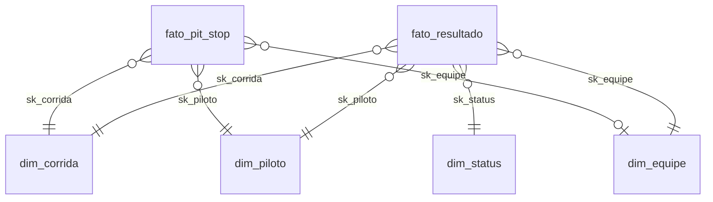

# Catálogo de Dados

Catálogo `mvp_f1` no Unity Catalog. As descrições abaixo também estão gravadas como `COMMENT` nas tabelas e colunas,
então aparecem no **Catalog Explorer** do Databricks (screenshots em `docs/img/`).

- **Tipo:** tipo físico no Delta Lake.
- **Domínio:** valores esperados. Os mínimos e máximos observados de fato estão no notebook `02_qualidade_bronze`.
- **Linhagem:** de onde o campo vem e qual transformação sofreu.

Fonte: Kaggle, `rohanrao/formula-1-world-championship-1950-2020` (CC0), cópia do Ergast Motor Racing Database.

---

## Camada Bronze

14 tabelas, uma por CSV, com o **mesmo nome do arquivo** e as **colunas originais** (camelCase), todas `STRING`,
com o nulo do Ergast mantido como o texto `\N`. Todas recebem os metadados `_arquivo_origem`, `_fonte` e `_data_ingestao`.

| Tabela | Conteúdo | Colunas originais |
|---|---|---|
| `bronze.circuits` | Circuitos | circuitId, circuitRef, name, location, country, lat, lng, alt, url |
| `bronze.constructors` | Equipes | constructorId, constructorRef, name, nationality, url |
| `bronze.drivers` | Pilotos | driverId, driverRef, number, code, forename, surname, dob, nationality, url |
| `bronze.races` | Corridas | raceId, year, round, circuitId, name, date, time, url, fp1_date … sprint_time |
| `bronze.results` | Resultado por piloto × corrida | resultId, raceId, driverId, constructorId, number, grid, position, positionText, positionOrder, points, laps, time, milliseconds, fastestLap, rank, fastestLapTime, fastestLapSpeed, statusId |
| `bronze.qualifying` | Classificação | qualifyId, raceId, driverId, constructorId, number, position, q1, q2, q3 |
| `bronze.pit_stops` | Paradas nos boxes | raceId, driverId, stop, lap, time, duration, milliseconds |
| `bronze.status` | Situação final | statusId, status |
| `bronze.driver_standings` | Campeonato de pilotos após cada corrida | driverStandingsId, raceId, driverId, points, position, positionText, wins |
| `bronze.constructor_standings` | Campeonato de construtores após cada corrida | constructorStandingsId, raceId, constructorId, points, position, positionText, wins |
| `bronze.lap_times` | Tempo de cada volta | raceId, driverId, lap, position, time, milliseconds |
| `bronze.sprint_results` | Resultado das sprints | mesmas colunas de results |
| `bronze.constructor_results` | Pontos da equipe por corrida | constructorResultsId, raceId, constructorId, points, status |
| `bronze.seasons` | Temporadas | year, url |
| `bronze.controle_ingestao` | Log de cada carga | tabela, arquivo, colunas, linhas, fonte, data_ingestao |

---

## Camada Silver

Transformações comuns a todas as tabelas: `\N` e vazio → `NULL`, `TRIM`, tipagem com `try_cast`, nomes em português
`snake_case`, e coluna `_data_processamento`.

### `silver.circuitos` ← bronze.circuits
| Coluna | Tipo | Descrição | Domínio | Linhagem |
|---|---|---|---|---|
| circuit_id | INT | Id do circuito (PK) | > 0 | circuitId |
| circuit_ref | STRING | Apelido técnico (ex.: monza) | texto | circuitRef |
| nome | STRING | Nome do circuito | texto | name |
| cidade | STRING | Cidade | texto | location |
| pais | STRING | País **padronizado** | USA/United States → United States; UK → United Kingdom; UAE → United Arab Emirates; Korea → South Korea | country |
| latitude | DOUBLE | Latitude | -90 a 90 | lat |
| longitude | DOUBLE | Longitude | -180 a 180 | lng |
| altitude_m | INT | Altitude em metros | pode ser NULL | alt |

### `silver.equipes` ← bronze.constructors
| Coluna | Tipo | Descrição | Domínio | Linhagem |
|---|---|---|---|---|
| constructor_id | INT | Id da equipe (PK) | > 0 | constructorId |
| constructor_ref | STRING | Apelido técnico | texto | constructorRef |
| nome | STRING | Nome da equipe | texto | name |
| nacionalidade | STRING | Nacionalidade da equipe | ex.: British, Italian | nationality |

### `silver.pilotos` ← bronze.drivers + de-para
| Coluna | Tipo | Descrição | Domínio | Linhagem |
|---|---|---|---|---|
| driver_id | INT | Id do piloto (PK) | > 0 | driverId |
| driver_ref | STRING | Apelido técnico | texto | driverRef |
| numero_permanente | INT | Número permanente | desde 2014; NULL antes | number |
| codigo | STRING | Código de 3 letras | ex.: HAM; NULL p/ antigos | code |
| nome | STRING | Primeiro nome | texto | forename |
| sobrenome | STRING | Sobrenome | texto | surname |
| nome_completo | STRING | Nome + sobrenome | texto | derivado |
| data_nascimento | DATE | Nascimento | 1890–2010 | dob |
| nacionalidade | STRING | Nacionalidade padronizada | TRIM; Argentinian → Argentine | nationality |
| pais | STRING | País da nacionalidade | mesmo padrão de circuitos.pais | de-para manual (notebook 03) |

### `silver.corridas` ← bronze.races
| Coluna | Tipo | Descrição | Domínio | Linhagem |
|---|---|---|---|---|
| race_id | INT | Id da corrida (PK) | > 0 | raceId |
| ano | INT | Temporada | 1950–2024 | year |
| rodada | INT | Etapa na temporada | ≥ 1 | round |
| circuit_id | INT | FK circuitos | > 0 | circuitId |
| nome_gp | STRING | Nome do GP | texto | name |
| data | DATE | Data da corrida | 1950–2024 | date |
| fim_de_semana_sprint | BOOLEAN | Teve sprint? | true/false | sprint_date não nulo |

### `silver.status` ← bronze.status
| Coluna | Tipo | Descrição | Domínio | Linhagem |
|---|---|---|---|---|
| status_id | INT | Id (PK) | > 0 | statusId |
| status | STRING | Status original | 130+ valores | status |
| categoria_status | STRING | Categoria | FINALIZOU, ACIDENTE, FALHA_MECANICA, PILOTO, NAO_LARGOU_OU_DESCLASSIFICADO, OUTROS | regra de categorização (notebook 03) |

### `silver.resultados` ← bronze.results
| Coluna | Tipo | Descrição | Domínio | Linhagem |
|---|---|---|---|---|
| result_id | INT | Id (PK) | > 0 | resultId |
| race_id / driver_id / constructor_id / status_id | INT | FKs | > 0 | raceId / driverId / constructorId / statusId |
| numero_carro | INT | Número do carro | ≥ 0 | number |
| grid | INT | Posição de largada | ≥ 1; **0 → NULL** | grid |
| flag_largou_boxes_ou_sem_grid | BOOLEAN | grid original = 0 | true/false | grid |
| posicao_oficial | INT | Posição oficial | ≥ 1; NULL se não classificado | position |
| posicao_texto | STRING | Posição como texto | número, R, D, W, N, F, E | positionText |
| posicao_final | INT | Ordem de chegada (sempre preenchida) | ≥ 1 | positionOrder |
| pontos | DOUBLE | Pontos | ≥ 0 | points |
| voltas | INT | Voltas completadas | ≥ 0 | laps |
| tempo_total_ms | BIGINT | Tempo total de prova | NULL p/ quem não terminou na volta do líder | milliseconds |
| volta_mais_rapida | INT | Nº da volta mais rápida | desde 2004 | fastestLap |
| ranking_volta_rapida | INT | Ranking da volta mais rápida | ≥ 1 | rank |
| tempo_volta_rapida_ms | BIGINT | Tempo da volta mais rápida | ms | fastestLapTime (m:ss.sss → ms) |
| velocidade_volta_rapida_kmh | DOUBLE | Velocidade média da volta | km/h | fastestLapSpeed |

### `silver.classificacao_grid` ← bronze.qualifying
| Coluna | Tipo | Descrição | Domínio | Linhagem |
|---|---|---|---|---|
| qualify_id | INT | Id (PK) | > 0 | qualifyId |
| race_id / driver_id / constructor_id | INT | FKs | > 0 | raceId / driverId / constructorId |
| posicao_classificacao | INT | Posição no qualifying | ≥ 1 | position |
| q1_ms / q2_ms / q3_ms | BIGINT | Tempos de cada sessão | ms; NULL se eliminado | q1 / q2 / q3 (m:ss.sss → ms) |
| melhor_tempo_ms | BIGINT | Melhor dos três | ms | LEAST(q1_ms, q2_ms, q3_ms) |

### `silver.pit_stops` ← bronze.pit_stops
| Coluna | Tipo | Descrição | Domínio | Linhagem |
|---|---|---|---|---|
| race_id / driver_id | INT | FKs | > 0 | raceId / driverId |
| numero_parada | INT | Ordem da parada | ≥ 1 | stop |
| volta | INT | Volta da parada | ≥ 1 | lap |
| duracao_ms | BIGINT | Tempo no pit lane | > 0 | milliseconds (não `duration`, que muda de formato acima de 60 s) |
| flag_parada_atipica | BOOLEAN | Duração > Q3 + 3·IQR da temporada | true/false | calculado |

### `silver.campeonato_pilotos` / `silver.campeonato_equipes` ← driver_standings / constructor_standings
| Coluna | Tipo | Descrição | Domínio | Linhagem |
|---|---|---|---|---|
| standing_id | INT | Id (PK) | > 0 | driverStandingsId / constructorStandingsId |
| race_id | INT | Corrida após a qual foi calculada | > 0 | raceId |
| driver_id / constructor_id | INT | FK | > 0 | driverId / constructorId |
| pontos_acumulados | DOUBLE | Pontos na temporada até a corrida | ≥ 0 | points |
| posicao_campeonato | INT | Posição no campeonato | ≥ 1 | position |
| vitorias_acumuladas | INT | Vitórias na temporada até a corrida | ≥ 0 | wins |

---

## Camada Gold (esquema estrela)

### `gold.dim_corrida`
| Coluna | Tipo | Descrição | Domínio | Linhagem |
|---|---|---|---|---|
| sk_corrida | INT | PK (= race_id) | > 0 | silver.corridas |
| ano | INT | Temporada | 1950–2024 | silver.corridas |
| decada | INT | Década | 1950…2020 | derivado |
| era_regulamentar | STRING | Bloco de regulamento | 1950-1967 Clássica; 1968-1982 Aerofólios e efeito solo; 1983-1988 Turbo; 1989-1994 Aspirados e eletrônica; 1995-2005 V10; 2006-2013 V8; 2014-2021 Híbrida V6 turbo; 2022-2024 Novo efeito solo | derivado de ano |
| rodada | INT | Etapa | ≥ 1 | silver.corridas |
| total_rodadas_temporada | INT | Nº de corridas do ano | ≥ 1 | derivado |
| flag_ultima_corrida | BOOLEAN | Última etapa do ano | true/false | derivado |
| nome_gp | STRING | Nome do GP | texto | silver.corridas |
| data | DATE | Data | — | silver.corridas |
| fim_de_semana_sprint | BOOLEAN | Teve sprint | true/false | silver.corridas |
| circuito_id, circuito_nome, circuito_cidade, circuito_pais, latitude, longitude | — | Circuito desnormalizado | — | silver.circuitos |

### `gold.dim_piloto`
| Coluna | Tipo | Descrição | Linhagem |
|---|---|---|---|
| sk_piloto | INT | PK (= driver_id) | silver.pilotos |
| nome_completo, codigo, nacionalidade, pais, data_nascimento | — | Atributos do piloto | silver.pilotos |

### `gold.dim_equipe`
| Coluna | Tipo | Descrição | Linhagem |
|---|---|---|---|
| sk_equipe | INT | PK (= constructor_id) | silver.equipes |
| nome, nacionalidade | STRING | Atributos da equipe | silver.equipes |

### `gold.dim_status`
| Coluna | Tipo | Descrição | Linhagem |
|---|---|---|---|
| sk_status | INT | PK (= status_id) | silver.status |
| status, categoria_status | STRING | Status e categoria | silver.status |

### `gold.fato_resultado` (1 linha por piloto × corrida)
| Coluna | Tipo | Descrição | Domínio | Linhagem |
|---|---|---|---|---|
| id_resultado | INT | Dimensão degenerada | > 0 | silver.resultados.result_id |
| sk_corrida, sk_piloto, sk_equipe, sk_status | INT | FKs | > 0 | silver.resultados |
| grid | INT | Posição de largada | ≥ 1 / NULL | silver.resultados |
| posicao_classificacao | INT | Posição no qualifying | ≥ 1; só no período com qualifying | silver.classificacao_grid |
| posicao_final | INT | Ordem de chegada | ≥ 1 | silver.resultados |
| posicao_oficial | INT | Posição oficial | ≥ 1 / NULL | silver.resultados |
| posicoes_ganhas | INT | grid − posicao_final | inteiro | derivado |
| pontos | DOUBLE | Pontos | ≥ 0 | silver.resultados |
| voltas | INT | Voltas completadas | ≥ 0 | silver.resultados |
| idade_piloto | DOUBLE | Idade na corrida | ~17–59 | derivado (data − nascimento) |
| qtd_pit_stops | INT | Nº de paradas | ≥ 0; NULL fora do período com pit stops | silver.pit_stops |
| tempo_medio_pit_ms | DOUBLE | Média das paradas sem atípicas | ms | silver.pit_stops |
| flag_pole | BOOLEAN | grid = 1 | — | derivado |
| flag_vitoria | BOOLEAN | posicao_oficial = 1 | — | derivado |
| flag_podio | BOOLEAN | posicao_oficial ≤ 3 | — | derivado |
| flag_largou | BOOLEAN | categoria ≠ NAO_LARGOU_OU_DESCLASSIFICADO | — | silver.status |
| flag_finalizou | BOOLEAN | categoria = FINALIZOU | — | silver.status |
| flag_em_casa | BOOLEAN | país do piloto = país do circuito | — | silver.pilotos.pais × silver.circuitos.pais |

### `gold.fato_pit_stop` (1 linha por parada)
| Coluna | Tipo | Descrição | Linhagem |
|---|---|---|---|
| sk_corrida, sk_piloto, sk_equipe | INT | FKs | silver.pit_stops (+ equipe via silver.resultados) |
| numero_parada, volta | INT | Ordem e volta da parada | silver.pit_stops |
| duracao_ms | BIGINT | Tempo no pit lane | silver.pit_stops |
| flag_parada_atipica | BOOLEAN | Parada atípica | silver.pit_stops |

### `gold.agg_temporada` (1 linha por temporada)
| Coluna | Tipo | Descrição | Domínio |
|---|---|---|---|
| ano | INT | Temporada | 1950–2024 |
| era_regulamentar | STRING | Era | ver dim_corrida |
| corridas | BIGINT | Nº de corridas | > 0 |
| vencedores_distintos | BIGINT | Pilotos diferentes que venceram | ≥ 1 |
| equipe_mais_vitoriosa | STRING | Equipe com mais vitórias | texto |
| pct_vitorias_equipe_top | DOUBLE | % de vitórias da equipe top | 0–100 |
| campeao | STRING | Piloto campeão | texto |
| pontos_campeao, pontos_vice | DOUBLE | Pontos finais | ≥ 0 |
| margem_campeao_pct | DOUBLE | (campeão − vice) / campeão × 100 | 0–100 |

Linhagem: fato_resultado + dim_corrida + silver.campeonato_pilotos (classificação após a última corrida).
